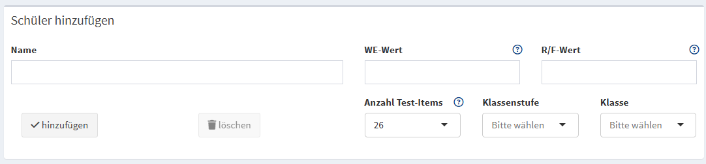
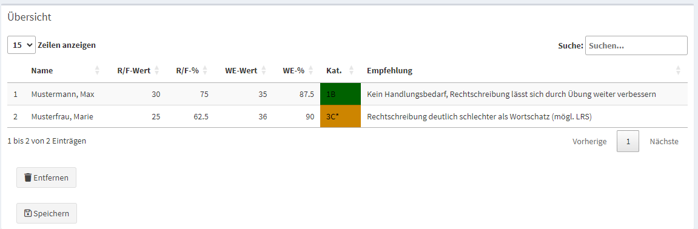
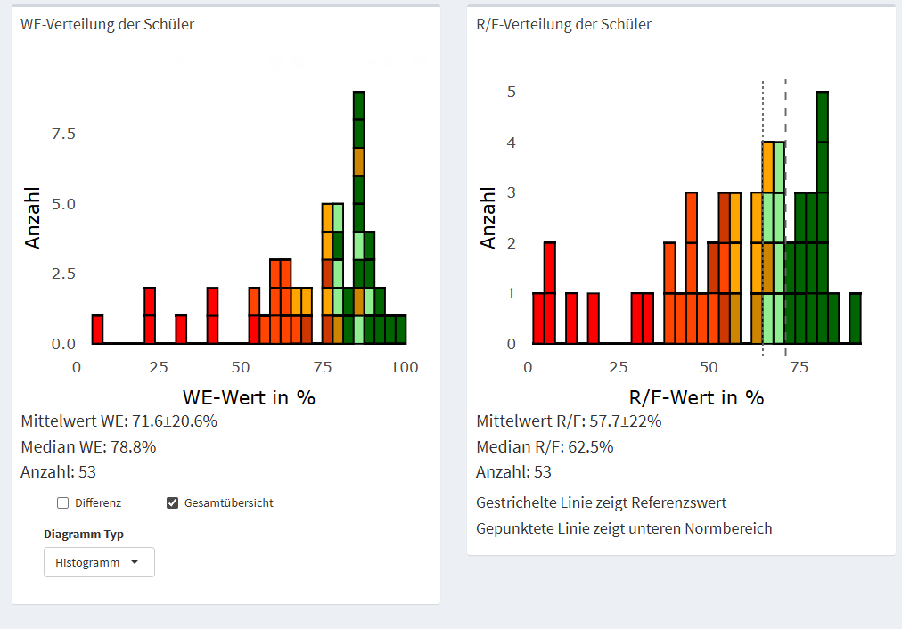
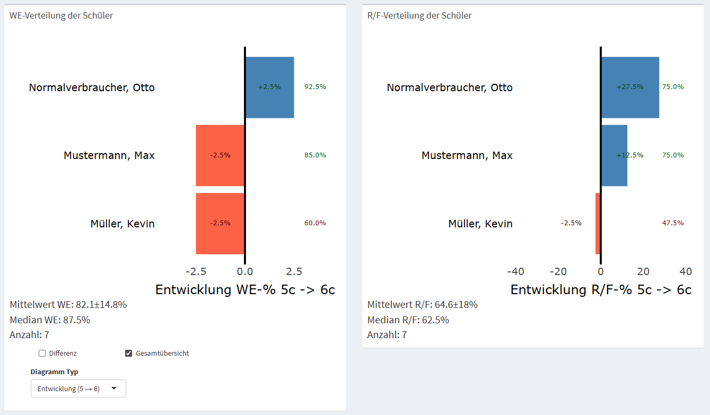

# C-Test Evaluation App

Diese R Shiny App ermöglicht die Evaluierung von C-Tests als diagnostisches Werkzeug im Deutschunterricht.

Für eine Anleitung auf Deutsch, siehe [hier](helpfiles/anleitung.md).

## Overview and Purpose

C-tests are a type of language proficiency assessment composed of several short texts in which the second half of every second word is deleted, requiring the test taker to use language competence to fill in the gaps. They are designed to measure a person's language ability across a wide range of proficiency levels by testing linguistic knowledge and textual competence in an integrated way.

The C-Test Evaluation App is an application designed to assess and evaluate student performance on C-Tests. By comparing student results to set reference values, the application provides actionable recommendations for student support and development. While the recommendations generated by the app serve as initial guidance, educators are encouraged to utilize additional diagnostic tools for a comprehensive evaluation if needed.




## Getting Started

### Start from source

R 4.5.x is required. Install the packages once, then start the app from the project folder:

```r
install.packages(readLines("req.txt"))
shiny::runApp()
```

For the parent letters and the Infobrief the app renders Word files, which needs
**pandoc**. RStudio ships its own; when starting outside RStudio, point
`RSTUDIO_PANDOC` to a pandoc installation, otherwise the letters cannot be rendered.

### First steps

- Adding Students: Navigate to the "Evaluation" section to enter each student's name along with their respective WE-value and R/F-value. After entering all relevant information, click "Add" to include the data into the overview table. Make sure that the number of test items is adjusted to match the number of completed gaps, and that the correct grade level and class are selected.
- Overview Table: The summary table compiles all entries and provides a clear overview of the recommended actions for each student. To correct any mistaken entries, select the student and use the "Remove" button to delete them.
- Saving Data: Once the evaluation is complete, data can be saved in Word and Excel formats, as well as a *.tsv file for future use. Files are written to `Auswertungen` next to the app; if that folder is not writable (for example an installation under `C:\ProgramData` without rights), the app falls back to `C-Test Auswertung` in the user's documents and names the folder in the message.
- Comparing two year levels: load the tsv file of the earlier and of the current year
  level one after the other (button `Laden`). The pair of year levels selected in the
  left menu applies to the development plots and to the Infobrief.

## Features and Functionality

A left-hand menu (illustrated within the app) allows users to access different features:

- Evaluation: Where to input and review student data, and save results.
- Statistics: distributions of the WE and R/F values, mean ± standard deviation and median
  per class, the development of two year levels (`Entwicklung` and `Verlauf`) and the
  table `Vergleich je Kind (zwei Stufen)` with one row per student.
- Infobrief: the teacher info letter summarising the development of a class across two
  year levels, including the review of the student matching (see below).
- Elternbrief: automated letters for parents as Word files, optionally with a QR code
  linking to the exercises.
- Anleitung: the manual (in German).




The plot types `Entwicklung (5 → 6)` and `Verlauf (5 → 6)` and the statistics of the
Infobrief only use students for whom two measurements exist - the matching across the two
year levels is done by name (spelling variants are tolerated). The appendix
`Vergleich je Kind` is deliberately different: it lists every student with the values that
exist (`62,5 → -`), so a missing year does not hide a value.

## Templates and settings

Parent letters and the Infobrief share one Word template. The tab `Elternbrief` opens it (and
the folder with the editable files: `table.png` for the result table, `ergebnisse.xlsx` for the
category texts). Editing happens on a personal copy under `Dokumente\C-Test Auswertung\vorlagen`,
which survives an update of the app; the same buttons create it on first use.

Personal entries - name, signature, exercise link, sender, class teacher, item count and the
statistics view - are written automatically to `einstellungen.txt` next to it and applied at the
next start, so they only have to be entered once. That file also holds the two R/F marks
(`rf_referenz`, `rf_norm_unten`); the categories of the procedure itself are not settings.

Before the parent letters or the Infobrief are rendered, the current data set is saved as a tsv
in the output folder, so a forgotten `speichern` no longer leaves only Word files behind (the
tsv is also the only file that carries the item count per student).

## Evaluation and Review

In the "Add Student" subsection, educators can swiftly enter and compile student data, setting up the number of test items and adjusting class settings as required.
The overview table not only summarizes the data but also provides sorting functionality to help educators identify students needing the most support.

## Lehrkräfte-Infobrief (Entwicklung über zwei Jahrgänge)

Für den Vergleich zweier Jahrgänge (z. B. 5c → 6c) gibt es den Tab `Infobrief`:

- links im Menü das Stufenpaar wählen (`Vergleich von Stufe` → `bis Stufe`). Die Auswahl
  ist gesperrt, solange keine zwei Jahrgänge geladen sind; im Normalfall ist das Paar mit
  den meisten zuordenbaren Kindern bereits eingestellt.
- die Zuordnung der Kinder zum Vorjahr prüfen und offene Vorschläge bestätigen oder
  trennen. Nicht eindeutige Fälle entscheidet die App bewusst nicht.
- die Entscheidungen werden als `zuordnung_5c-6c.tsv` (Name aus den Klassen der beiden
  Jahrgänge abgeleitet) im Auswertungsordner gespeichert, enthalten die Quelldateien und
  eine Prüfsumme und werden beim nächsten Lauf automatisch wieder angewendet.
- der Brief nennt je Klassenbuchstabe `n (mit Werten)`, `WE % (Mittel ± SD)` und
  `R/F % (Mittel ± SD)`, die Kinder unter dem unteren Normbereich samt Vorjahresvergleich,
  die größten Verbesserungen und die schwächste Entwicklung. Danach folgen die Seite
  `Hinweise` (neue Kinder, fehlende Vorjahreswerte, unbestätigte Vorschläge, Kinder ohne
  Teilnahme) und der Anhang `Vergleich je Kind`.

Das Entwicklungsdiagramm im Tab Statistik nutzt dieselbe Zuordnung. Beim Speichern landet
die Vergleichstabelle zusätzlich als Blatt `Vergleich` im Excel-Export und als Anhang in
der Word-Auswertung.

## Windows-Installer bauen

Die App wird als Setup für Windows ausgeliefert (Inno Setup; portables R, Chrome und
pandoc liegen im Setup - auf den Zielrechnern muss nichts installiert werden):

```powershell
.\build\build_factory.ps1 -Version 1.7         # Version sonst aus app.R
.\build\build_factory.ps1 -SkipRuntime         # nur Setup neu bauen
```

Das Skript baut den Auslieferungsordner, ruft Inno Setup auf und legt das Setup unter
`<FactoryDir>\Output\ctest_auswertung_<Version>.exe` ab. Schalter und Voraussetzungen
stehen in [build/README.md](build/README.md); die Version wird zentral in `APP_VERSION`
in `app.R` gepflegt.

**Automatisch:** `.github/workflows/release.yml` ruft dasselbe Skript auf GitHub auf.
Ein Tag `v*` (mit passender `APP_VERSION` in `app.R`) lässt Testsuite und Setup laufen und
hängt das Setup an das Release; der Release-Text kommt aus [CHANGELOG.md](CHANGELOG.md).
Ein manueller Start über „Actions → Windows-Setup → Run workflow" baut nur und legt das
Setup als Artefakt ab.

## Tests

Die Testsuite liegt in `tests/` und ist nicht Teil der installierten App:

```
install.packages(c(readLines("req.txt"), readLines("req_dev.txt")))
Rscript tests/run_tests.R
```

Die Tests laden die App (`global.R`), brauchen also **alle** Pakete aus `req.txt` – `req_dev.txt`
liefert nur `testthat` und `withr` dazu.

Sie deckt Rechenkern, tsv-Rundlauf (inklusive robustem Laden mit anderen Spaltennamen, Itemzahl
und Plausibilitätsprüfung), Word/Excel-Export, Elternbrief- und Infobrief-Erzeugung, App-Abläufe
ohne Browser, Schreibrechte, Einstellungen, Vorlagen, Datensicherung, gesperrte Zieldateien,
Offline-Verhalten und die Namensauflösung (Paket-Verdeckungen) ab – aktuell 159 Tests mit 867
Erwartungen (Stand Version 1.7).

## Projektstruktur

```
app.R, ui.R, server.R, global.R   Einstieg, Oberfläche, Server-Logik
components/                       header, sidebar, body (UI-Bausteine)
functions/                        Rechenkern, Kohorten-/Namensabgleich, Briefe, Exporte
elternbrief/                      Vorlagen und Text des Elternbriefs (Rmd, docx, xlsx)
infobrief/                        Vorlagen und Text des Infobriefs (Rmd, docx, yml)
helpfiles/                        Anleitung und Hilfetexte (inkl. Screenshots)
tests/                            Testsuite (testthat) mit Fixtures
build/                            Build-Skript, Inno-Setup-Skript, Launcher, Icon
```
