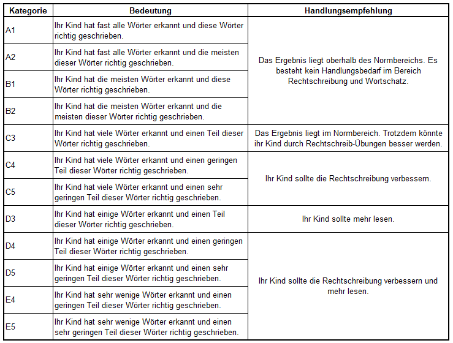

```{r setup, include=FALSE}
library(officer)
knitr::opts_chunk$set(echo = TRUE)
```
`r fpar(format(Sys.Date(), "%d.%m.%Y"), fp_p = fp_par(text.align = "right"))`

<br />

<br />

<br />

## Diagnostik im Fach Deutsch im Jahrgang `r klasse`

<br />

<br />

Liebe Eltern und Erziehungsberechtigte von `r name`,

<br />

ich möchte Sie darüber informieren, dass alle Schülerinnen und Schüler der 5. Klasse im ersten Quartal eine Diagnose in den Bereichen Wortschatz und Rechtschreibung durchgeführt haben.

Diese ersten Diagnosen dienen dazu, einen Überblick über die aktuelle Lernausgangslage der Kinder zu bekommen. Die Ergebnisse werden **nicht benotet**, sondern helfen uns dabei festzustellen, wo bereits gute Fähigkeiten vorhanden sind und in welchen Bereichen noch Unterstützung benötigt wird.

Ziel ist es, den Unterricht noch gezielter auf die Bedürfnisse der Schülerinnen und Schüler auszurichten und individuelle Förderung zu ermöglichen. Die Ergebnisse der Diagnose sind nun ausgewertet und bilden die Grundlage für unsere weitere Arbeit im Unterricht. Das Ergebnis für Ihr Kind lautet:

<br />

`r fpar(ftext(kat, fp_text(bold = TRUE)), fp_p = fp_par(text.align = "center", padding.top = 6, padding.bottom = 6))`

Weitere Informationen zu dem Ergebnis finden Sie auf der nächsten Seite.

Bitte beachten Sie, dass es sich hierbei um eine reine Bestandsaufnahme handelt, die den Kindern keinerlei Druck machen soll. Wir möchten, dass sich alle wohlfühlen und die Möglichkeit bekommen, sich ohne Stress weiterzuentwickeln. Falls Sie Fragen haben oder einen Gesprächstermin wünschen, stehe ich Ihnen gerne zur Verfügung.

<br />

<br />

Mit freundlichen Grüßen,

`r lehrername`

`r signatur`

\newpage

## Ergebnisse

Die folgende Tabelle gibt einen Überblick über die möglichen Ergebnisse des C-Tests und die sich daraus ergebenden Handlungsempfehlungen.

{width="945"}

