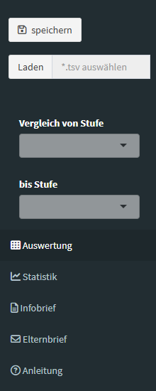
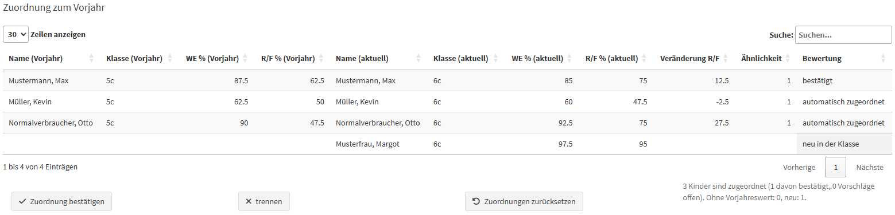
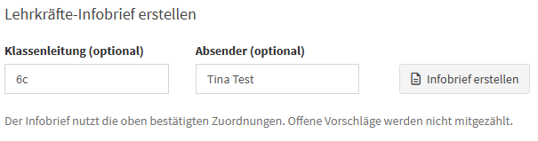

```{=html}
<style type="text/css">
  blockquote {
    padding: 10px 20px;
    margin: 0 0 20px;
    font-size: 15px;
    border-left: 5px solid #eee;
}
</style>
```

## C-Test-Auswertungstool

Diese Anwendung dient der Auswertung von C-Tests. Die Leistungen der Schüler werden anhand von Referenzwerten bewertet und eine Empfehlung zur Förderung der Schüler wird generiert.

Diese Empfehlung sollte allerdings als erster Hinweis verstanden werden und im Bedarfsfall mit weiteren diagnostischen Werkzeugen verifiziert werden.

#### Schritt-für-Schritt

Dies ist eine **Schnell-Start Anleitung** mit den wichtigsten Schritten. Weitere Informationen sind in den folgenden Kapiteln zu finden.

1.  **Schüler hinzufügen**: Gehen Sie zum Menüpunkt "Auswertung". Hier können Sie den `Name` des Schülers sowie den entsprechenden `WE-Wert` und `R/F-Wert` je Schüler eingeben. Klicken Sie auf `Hinzufügen`, um die Daten zur `Übersichtstabelle` hinzuzufügen. Stellen Sie sicher, dass `Anzahl der Test-Items` auf die Anzahl der bearbeiteten Lücken eingestellt ist und dass die `Klassenstufe` und `Klasse` richtig gewählt ist.

2.  **Übersichtstabelle**: Die `Übersichtstabelle` fasst alle Einträge zusammen und gibt Auskunft über die Handlungsempfehlungen je Schüler. Wenn ein oder mehrere Schüler falsch eingetragen wurden, können diese durch Anklicken markiert und mit dem `Entfernen`-Button gelöscht werden.

3.  **Daten speichern**: Ist die Auswertung abgeschlossen, können Sie mit dem `Speichern`-Button die Daten als Word- und Excel-Dokument ablegen. Es wird auch eine \*.tsv Datei erstellt, die später wieder geladen werden kann.

4.  **Suchfunktion**: Einzelne Schüler lassen sich durch Eintrag des Namens in das Feld `Suchen` finden.

5.  **Zwei Jahrgänge vergleichen**: Für Entwicklungsdiagramm und Infobrief laden Sie mit dem `Laden`-Button nacheinander die \*.tsv-Datei des früheren und die des aktuellen Jahrgangs. Prüfen Sie links im Menü das Stufenpaar (`Vergleich von Stufe` → `bis Stufe`), kontrollieren Sie im Tab `Infobrief` die Zuordnung der Kinder und erstellen Sie dort den Infobrief.

#### Übersicht über die Funktionen

{style="float:left;margin-left:5px;margin-right:25px" width="150"}

Auf der linken Seite befindet sich ein Menüband (siehe Abbildung).

Die oberen beiden Buttons können genutzt werden um die aktuell geladenen/eingegebenen Daten zu speichern bzw. bereits vorhandene Daten im \*.tsv-Format zu laden. Es können auch mehrere Datensätze nacheinander geladen werden um so erweiterte Analysen durchzuführen.

Unter dem Laden-Button stehen `Vergleich von Stufe` und `bis Stufe`: hier wird festgelegt, welche beiden Jahrgänge verglichen werden (z. B. 5 → 6). Die Auswahl gilt für das Entwicklungsdiagramm im Tab Statistik **und** für den Infobrief. Sobald zwei Jahrgänge geladen sind, ist das Stufenpaar mit den meisten zuordenbaren Kindern bereits eingestellt. Solange keine zwei Jahrgänge geladen sind, ist die Auswahl gesperrt und darunter erscheint ein kurzer Hinweis, was zu tun ist – im Normalfall steht dort nichts.

1.  **Auswertung**: Hier können die **Schülerdaten eingegeben**, die Ergebnisse als **Tabelle betrachtet** und **gespeichert** werden.
2.  **Statistik**: Hier können Verteilungen und Kennzahlen (Mittelwert ± Standardabweichung, Median) betrachtet sowie die **Entwicklung zweier Jahrgänge** dargestellt werden.
3.  **Infobrief**: Hier wird die **Zuordnung der Kinder zum Vorjahr** geprüft und der **Infobrief für das Kollegium** erstellt (siehe unten).
4.  **Elternbrief**: Hier können automatisiert Elternbriefe erstellt werden.
5.  **Anleitung**: Diese Anleitung.

<br>
<br>

### Auswertung

#### Schüler hinzufügen

Dieser Unterpunkt dient vor allem dem Einpflegen der Schülerdaten. Hier können der `Name` des Schülers sowie der entsprechende `WE-Wert` und `R/F-Wert` je Schüler eingegeben werden und mit `Hinzufügen` zur `Übersichtstabelle` hinzugefügt werden. Vor der Eingabe des ersten Schülers sollte `Anzahl der Test-Items` auf die Anzahl der bearbeiteten Lücken (typischerweise 20 pro Text) eingestellt werden. Dieser Wert sollte eigentlich für alle Schüler gleich sein. Falls ein Schüler nur einen Teil der Texte bearbeitet hat, kann der Wert aber auch für jeden Schüler verändert werden. Weiterhin muss die `Klassenstufe` und `Klasse` eingestellt werden. Normalerweise sollte auch dies für alle Schüler gleich sein, kann aber wie die `Anzahl der Test-Items` für jeden Schüler individuell gesetzt werden sodass auch mehrere Klassen aufeinmal eingetragen werden können.

Wurde ein oder mehrere Schüler falsch eingetragen, können diese durch Anklicken markiert und mit dem `löschen`-Button gelöscht werden.

{width="600"}

> **Tipp**: Am schnellsten lassen sich Schüler eingeben, indem man die Felder mit der **Tabulatortaste** wechselt. Also ins Feld `Name` klicken, `Name` eingeben, **Tab** (Cursor springt ins Feld `WE-Wert`), `WE-Wert` eintragen, **Tab**, `R/F-Wert` eintragen, **Tab** (`Hinzufügen`-Button ist markiert), **Enter** (Cursor springt zurück ins Feld **Name** und der nächste Schüler kann eingetragen werden).

#### Übersichtstabelle

Die `Übersichtstabelle` fasst alle Einträge zusammen und gibt Auskunft über die Handlungsempfehlungen je Schüler.

> **Tipp**: Die Tabelle lässt sich sortieren, indem man auf die Spaltennamen klickt. Dabei wechselt die Ansicht zwischen absteigend und aufsteigend. Sortiert man nach `Kat.`, kann man beispielsweise schnell die Schüler ermitteln, die am meisten Unterstützung brauchen.

Ist die Auswertung abgeschlossen, kann man mit dem `Speichern`-Button die Daten als Word- und Excel-Dokument ablegen (siehe linkes Menüband). Weiterhin wird eine \*.tsv Datei erstellt, die später wieder geladen werden kann (siehe Kapitel Erweitert).

Einzelne Schüler lassen sich durch Eintrag des Namens in das Feld `Suchen` finden.

{width="600"}

#### Speichern und Ausgabeordner

Alle Dateien landen im Ordner `Auswertungen`. Nach dem Speichern öffnet die App diesen Ordner automatisch, der Pfad steht zusätzlich in der Meldung. Kann die App dort nicht schreiben (zum Beispiel, weil sie unter `C:\ProgramData` installiert ist und der angemeldete Benutzer dort keine Rechte hat), weicht sie auf den Ordner `C-Test Auswertung` in den eigenen Dokumenten aus – die Meldung nennt dann diesen Pfad. Ist keiner der beiden Ordner beschreibbar, meldet die App einen Fehler, statt die Arbeit stillschweigend zu verwerfen.

### Statistik

Hier können die eingegebenen Daten als Diagramme dargestellt werden.

{width="700"}

Das linke Diagramm zeigt den `WE-Wert` in Prozent. Mit der Checkbox `Differenz` zeigt es stattdessen die Differenz zwischen `WE-Wert` und `R/F-Wert`. Da der `WE-Wert` immer mindestens so hoch ist wie der `R/F-Wert`, zeigt diese Differenz, wie viele Wörter erkannt, aber falsch geschrieben wurden. Mit der Checkbox `Gesamtübersicht` werden (falls mehrere Klassen vorhanden sind) alle Daten zusammen oder nach Klasse getrennt ausgewertet.

Das rechte Diagramm zeigt die `R/F-Werte` in Prozent; die gestrichelte Linie markiert den Referenzwert für Gesamtschulen und die gepunktete Linie den unteren Grenzwert des Normalbereichs (65 %). Alle Schüler, die unterhalb dieser Grenze liegen, brauchen u.U. Unterstützung oder sollten zumindest näher betrachtet werden. Unter den Diagrammen stehen Mittelwert ± Standardabweichung sowie der Median; der Median wird nur hier in der App angezeigt, im Infobrief steht er nicht.

Mit `Diagramm Typ` wird die Darstellung gewählt:

-   `Histogramm`: Verteilung der Werte.
-   `Dichte`: geglättete Verteilung, praktisch um mehrere Klassen zu vergleichen.
-   `Entwicklung (5 → 6)`: je Kind ein Balken mit der Veränderung vom früheren zum aktuellen Jahrgang (blau = Verbesserung, rot = Rückgang), daneben der aktuelle Wert. Bezieht sich auf das links eingestellte Stufenpaar.
-   `Verlauf (5 → 6)`: eine Linie je Kind über die beiden Jahrgänge, oben der WE-Wert, unten der R/F-Wert. Lohnt sich vor allem bei kleinen Gruppen – bei vielen Kindern werden die Linien unübersichtlich.

{width="1000"}

> **Tipp**: Die Diagramme sind interaktiv. Mit der Maus lässt sich ein Bereich aufziehen (Zoom), und beim Überfahren der Balken werden die zugehörigen Schüler angezeigt.

Die Diagrammtypen `Entwicklung` und `Verlauf` verwenden **nur Kinder, für die beide Messungen vorliegen**. Grundlage ist dieselbe Zuordnung, die auch der Infobrief nutzt (siehe unten).

#### Vergleich je Kind (zwei Stufen)

Sobald zwei Jahrgänge geladen und einander zugeordnet sind, steht unter den Diagrammen die Tabelle `Vergleich je Kind (zwei Stufen)`: eine Zeile je Kind mit `Name`, `Klasse` (z. B. `5c → 6c`), `WE % (5 → 6)`, `Δ WE`, `R/F % (5 → 6)` und `Δ R/F`. Die Spalten lassen sich durch Klick auf die Überschrift sortieren, das Suchfeld filtert nach Namen. Rückgänge stehen rot, Verbesserungen grün; ab 20 Prozentpunkten zusätzlich fett.

### Lehrkräfte-Infobrief

Der Infobrief fasst die **Entwicklung einer Klasse über zwei Jahrgänge** zusammen. Er ist für das Kollegium gedacht (nicht für die Eltern). Im Tab `Infobrief` steht oben der Abschnitt zum Erstellen des Briefes, darunter die Zuordnungstabelle.

#### Voraussetzungen

1.  **Zwei Jahrgänge laden**: die \*.tsv-Datei des früheren Jahrgangs und die des aktuellen (Laden-Button oben links). Die Klasse bleibt über die Jahre gleich (z. B. 5c → 6c), deshalb findet die App dieselben Kinder über den Namen wieder.

2.  **Vergleich einstellen**: links im Menü stehen `Vergleich von Stufe` und `bis Stufe`. Die Auswahl ist gesperrt, solange keine zwei Jahrgänge geladen sind – dann steht darunter ein Hinweis. Ein Vorschlag (das Paar mit den meisten zuordenbaren Kindern) ist bereits eingestellt.

3.  **Zuordnung prüfen**: Die Tabelle im Abschnitt `Zuordnung zum Vorjahr` listet die Kinder beider Jahrgänge mit Bewertung.
    -   *automatisch zugeordnet*: Der Name stimmt eindeutig überein (Schreibvarianten wie "Beispel" statt "Beispiel" oder ein anderer Bindestrich sind kein Problem).
    -   *Vorschlag (bitte prüfen)*: Die Namen sind ähnlich, aber nicht eindeutig (z. B. fehlender Zweitname). Zeile markieren und `Zuordnung bestätigen` oder `trennen` wählen.
    -   *nicht eindeutig*: Derselbe Name kommt in einer Stufe mehrfach vor – hier entscheidet die App bewusst nicht.
    -   `Zuordnungen zurücksetzen` verwirft alle Entscheidungen nach einer Rückfrage.

    Die Entscheidungen werden gespeichert und beim nächsten Lauf automatisch wieder angewendet (siehe *Zuordnung und Ausgabe*).

{width="1000"}

4.  **Brief erstellen**: optional `Klassenleitung` (z. B. "6c") und `Absender` eintragen, dann `Infobrief erstellen`. Es entsteht eine Word-Datei je Stufenpaar (z. B. `Infobrief_5-6_5c_6c.docx`) im Auswertungsordner.

{width="600"}

#### Inhalt des Briefes

-   Kopf mit Datum, Überschrift (Jahrgang X im Vergleich zu Jahrgang Y) und Anrede – die Klassenleitung, falls angegeben.
-   Je Klassenbuchstabe ein Abschnitt `Kohorte <Buchstabe>` mit einer Tabelle: eine Zeile je Klasse und Jahrgang, mit `n (mit Werten)`, `WE % (Mittel ± SD)` und `R/F % (Mittel ± SD)`.
-   Darunter: wie viele Kinder aktuell unter dem unteren Normbereich (R/F-Wert unter 65 %) liegen, wie viele davon schon im Vorjahr betroffen waren und wie viele neu hinzugekommen sind bzw. den Normbereich wieder erreicht haben.
-   Ein Hinweis auf deutliche Rückgänge (mehr als 10 %); solche Werte sind farbig hervorgehoben (grün = Verbesserung, rot = Rückgang) und ab 20 Prozentpunkten zusätzlich fett.
-   Die Tabellen `Die größten Verbesserungen` und `Die schwächste Entwicklung` mit je bis zu 5 Kindern. Bei der schwächsten Entwicklung stehen zuerst die Kinder, die weiterhin unter dem unteren Normbereich liegen.
-   Auf einer eigenen Seite `Hinweise`, danach auf einer weiteren Seite der `Anhang: Vergleich je Kind` mit allen Kindern in alphabetischer Reihenfolge (gleiche Spalten wie die Vergleichstabelle im Tab Statistik).

#### Hinweise im Brief

Diese Punkte stehen unter `Hinweise`. Die Kinder werden dort mit Namen genannt, weil sie in keiner der Tabellen auftauchen:

-   Neu in der Klasse (kein Vorjahreswert).
-   Kein Partner im aktuellen Jahrgang gefunden.
-   Nicht eindeutig zuzuordnen (gleicher Name mehrfach).
-   Noch nicht bestätigte Zuordnungen – diese werden nicht mitgezählt.
-   Klassenwechsel (Kind ist im aktuellen Jahrgang in einer anderen Klasse).
-   Nicht teilgenommen (Kategorie 0).

#### Zuordnung und Ausgabe

-   Die Zuordnungsdatei heißt nach den Klassen der beiden Jahrgänge, z. B. `zuordnung_5c-6c.tsv`, und liegt im Auswertungsordner. Neben den Entscheidungen stehen darin die Quelldateien und eine Prüfsumme: Passt die Prüfsumme nicht zu den geladenen Daten, weist die App darauf hin, dass die gespeicherte Zuordnung zu anderen Daten gehört.
-   Nach dem Erstellen des Briefes öffnet die App den Auswertungsordner; die Meldung nennt den Dateinamen.
-   Sobald ein Vergleich möglich ist, enthält die Excel-Datei beim `Speichern` ein zusätzliches Blatt `Vergleich` mit derselben Tabelle; die Word-Auswertung bekommt sie als Anhang.

> **Hinweis**: Ausgewertet werden nur Kinder, für die zwei Messungen vorliegen. Alle anderen (neue Kinder, fehlende Vorjahreswerte, nicht bestätigte Vorschläge, nicht teilgenommene Kinder) erscheinen unter `Hinweise` und werden nicht mitgezählt.

### Tests

Fuer die Weiterentwicklung gibt es eine Testsuite (nicht Teil der installierten App):

```
Rscript tests/run_tests.R            # alle Tests
Rscript tests/run_tests.R cohort     # nur eine Datei (Filter)
```

Voraussetzung sind die Pakete aus `req_dev.txt` (`install.packages(readLines("req_dev.txt"))`). Ohne pandoc werden die Tests übersprungen, die Word-Dateien rendern.
