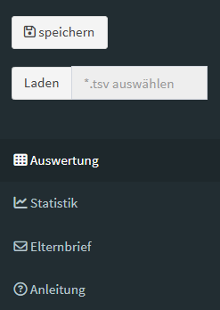
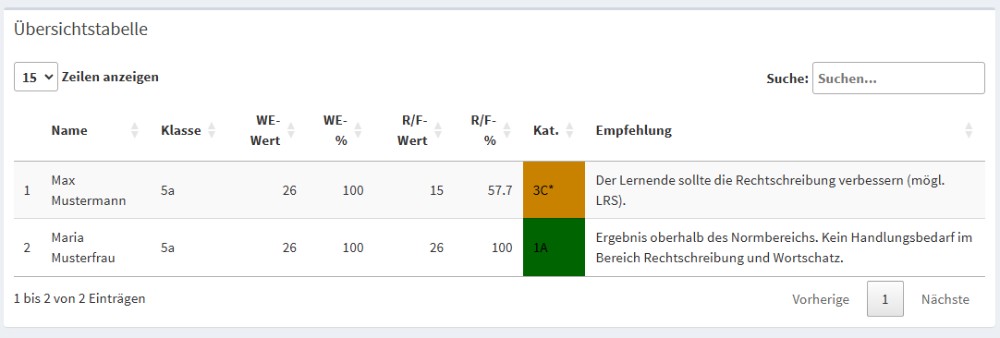
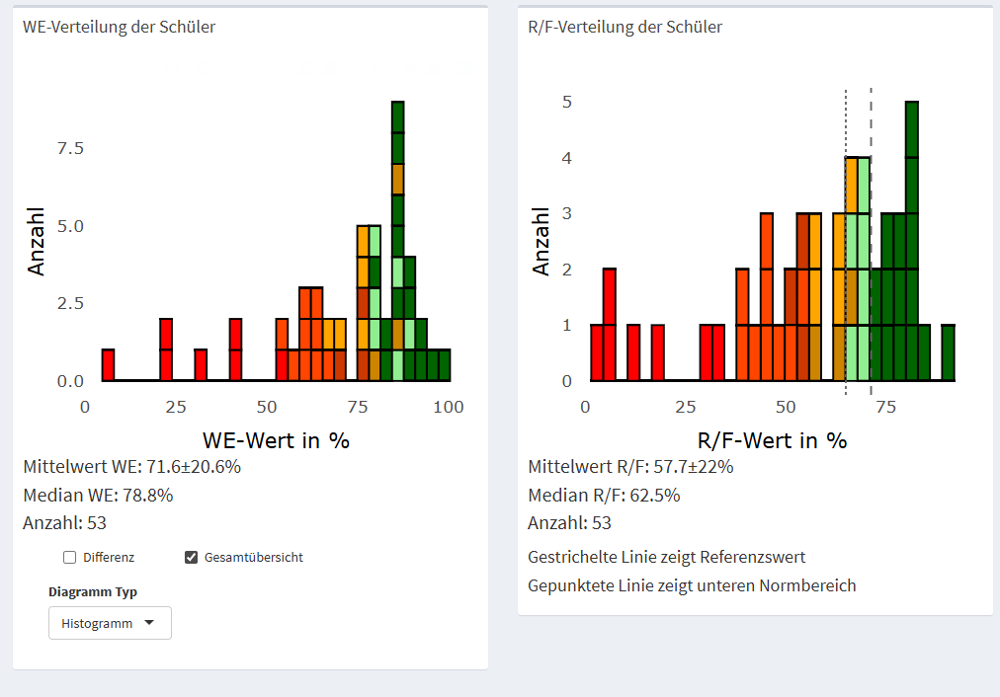

## C-Test-Auswertungstool

Diese Anwendung dient der Auswertung von C-Tests. Die Leistungen der Schüler werden anhand von Referenzwerten bewertet und eine Empfehlung zur Förderung der Schüler wird generiert.

Diese Empfehlung sollte allerdings als erster Hinweis verstanden werden und im Bedarfsfall mit weiteren diagnostischen Werkzeugen verifiziert werden.

## Schritt-für-Schritt

Dies ist eine **Schnell-Start Anleitung** mit den wichtigesten Schritten. Weitere Informationen sind in den folgenden Kapiteln zu finden.

1. **Schüler hinzufügen**: Gehen Sie zum Menüpunkt "Auswertung". Hier können Sie den `Name` des Schülers sowie den entsprechenden `WE-Wert` und `R/F-Wert` je Schüler eingeben. Klicken Sie auf `Hinzufügen`, um die Daten zur `Übersichtstabelle` hinzuzufügen. Stellen Sie sicher, dass `Anzahl der Test-Items` auf die Anzahl der bearbeiteten Lücken eingestellt ist und das die `Klassenstufe` und `Klasse` richtig gewählt ist.

2. **Übersichtstabelle**: Die `Übersichtstabelle` fasst alle Einträge zusammen und gibt Auskunft über die Handlungsempfehlungen je Schüler. Wenn ein oder mehrere Schüler falsch eingetragen wurden, können diese durch Anklicken markiert und mit dem `Entfernen`-Button gelöscht werden.

3. **Daten speichern**: Ist die Auswertung abgeschlossen, können Sie mit dem `Speichern`-Button die Daten als Word- und Excel-Dokument ablegen. Es wird auch eine \*.tsv Datei erstellt, die später wieder geladen werden kann.

4. **Suchfunktion**: Einzelne Schüler lassen sich durch Eintrag des Namens in das Feld `Suchen` suchen.

## Übersicht über die Funktionen

{style="float:left;margin-left:5px;margin-right:25px" width="150"}

Auf der linken Seite befindet sich ein Menüband (siehe Abbildung).

1.  **Anleitung**: Diese Anleitung.
2.  **Auswertung**: Hier können die **Schülerdaten eingegeben**, die Ergebnisse als **Tabelle betrachtet** und **gespeichert** werden.
3.  **Statistik**: Hier können **Mittelwert und Median** für `R/F-Wert` und `WE-Wert` eingesehen werden. Weiterhin können die Daten hier als Histogramm **graphisch dargestellt** werden.
4.  **Erweitert**: Hier finden sich erweiterte Funktionen für fortgeschrittene Benutzer. Aktuell können hier gespeicherte **Daten geladen** werden.

&nbsp;
&nbsp;
&nbsp;
&nbsp;
&nbsp;
&nbsp;
  
### Auswertung

#### Schüler hinzufügen

Dieser Unterpunkt dient vor allem dem Einpflegen der Schülerdaten. Hier können der `Name` des Schülers sowie der entsprechende `WE-Wert` und `R/F-Wert` je Schüler eingegeben werden und mit `Hinzufügen` zur `Übersichtstabelle` hinzugefügt werden. Vor der Eingabe des ersten Schülers sollte `Anzahl der Test-Items` auf die Anzahl der bearbeiteten Lücken (typischerweise 20 pro Text) eingestellt werden. Dieser Wert sollte eigentlich für alle Schüler gleich sein. Falls ein Schüler nur einen Teil der Texte bearbeitet hat, kann der Wert aber auch für jeden Schüler verändert werden.
Weiterhin muss die `Klassenstufe` und `Klasse` eingestellt werden. Normalerweise sollte auch dies für alle Schüler gleich sein, kann aber wie die `Anzahl der Test-Items` für jeden Schüler individuell gesetzt werden sodass auch mehrere Klassen aufeinmal eingetragen werden können.

{width="800"}

> **Tipp**: Am schnellsten lassen sich Schüler eingeben, indem man die Felder mit der **Tabulatortaste** wechselt. Also ins Feld `Name` klicken, `Name` eingeben, **Tab** (Cursor springt ins Feld `WE-Wert`), `WE-Wert` eintragen, **Tab**, `R/F-Wert` eintragen, **Tab** (`Hinzufügen`-Button ist markiert), **Enter** (Cursor springt zurück ins Feld **Name** und der nächste Schüler kann eingetragen werden).

#### Übersichtstabelle

Die `Übersichtstabelle` fasst alle Einträge zusammen und gibt Auskunft über die Handlungsempfehlungen je Schüler.

> **Tipp**: Die Tabelle lässt sich sortieren, indem man auf die Spaltennamen klickt. Dabei wechselt die Ansicht zwischen absteigend und aufsteigend. Sortiert man nach `Kat.`, kann man beispielsweise schnell die Schüler ermitteln, die am meisten Unterstützung brauchen.

Wurde ein oder mehrere Schüler falsch eingetragen, können diese durch Anklicken markiert und mit dem `Entfernen`-Button gelöscht werden. Ist die Auswertung abgeschlossen, kann man mit dem `Speichern`-Button die Daten als Word- und Excel-Dokument ablegen. Weiterhin wird eine \*.tsv Datei erstellt, die später wieder geladen werden kann (siehe Kapitel Erweitert).

Einzelne Schüler lassen sich durch Eintrag des Namens in das Feld `Suchen` suchen.

{width="800"}

### Statistik

Hier können die eingegebenen Daten als Histogramme visualisiert werden.

{width="800"}

> **Tipp**: Die Diagramme können interaktiv gezoomt werden und wenn man die Maus über ein Kästchen bewegt, werden die einzelnen Schüler angezeigt.

Das linke Diagramm zeigt die `R/F-Werte` in Prozent; die gestrichelte Linie markiert den Referenzwert für Gesamtschulen und die gepunktete Linie den unteren Grenzwert des Normalbereichs (alle Schüler, die unterhalb dieser Grenze liegen, brauchen u.U. Unterstützung oder sollten zumindest näher betrachtet werden). Unter dem Diagramm wird außerdem der Mittelwert des `R/F-Werts` in Prozent (± Standardabweichung) sowie der Median angezeigt.

Das rechte Diagramm zeigt den `WE-Wert` in Prozent. Mit `Diagramm Typ` kann entweder die Verteilung der `WE-Werte` oder die Differenz zwischen `R/F-Wert` und `WE-Wert` dargestellt werden.